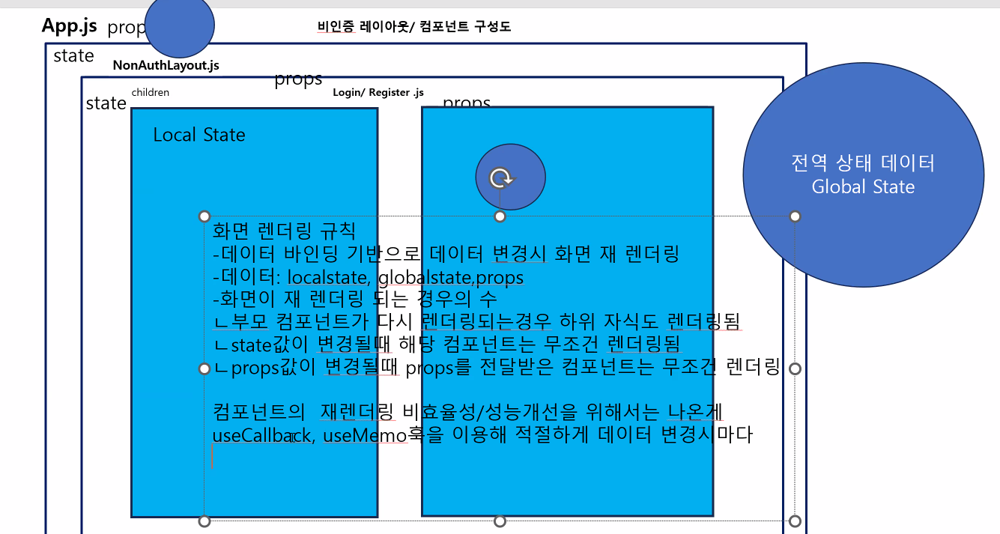

---

 
## Redux

- Action

## React 기술정리

1. UI/UX

   - JSX(HTML, CSS, CSS Framework)
   - props (화면에 데이터를 처리할 수 있는 props), localState(useState) =>화면안에서만 정의해서 쓰는것
   - Events(onClick, onSubmit, onChange...)
   - Databinding(MVVM pattern)
   - Hooks(useState, useEffect, useMemo, useCallback, useDispatch, useSelector)

2. Routing

   - Layout(App.js)
   - react-router-dom (패키지 설치)
   - routing
   - lazy()+suspense

3. Data처리 및 전역데이터 관리기법

   - axios(백엔드와 데이터 처리) + hooks()
   - Global Stated(cotextAPI, Redux)

4. 로직처리 미들웨어 적용 - redux saga - 옵션

   - 화면 컴포넌트에서 각종 데이터 처리(RESTFul 통신) 로직 분리
   - 프로세스, 워크플로우 순서기반 로직처리시 사용
