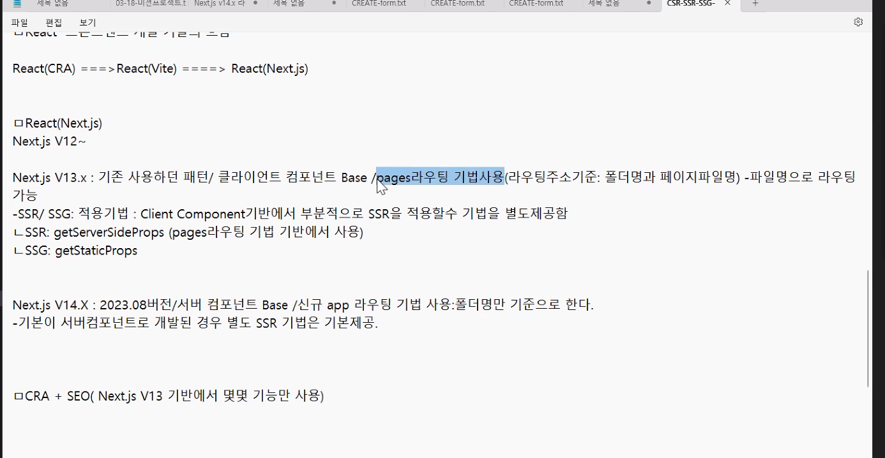
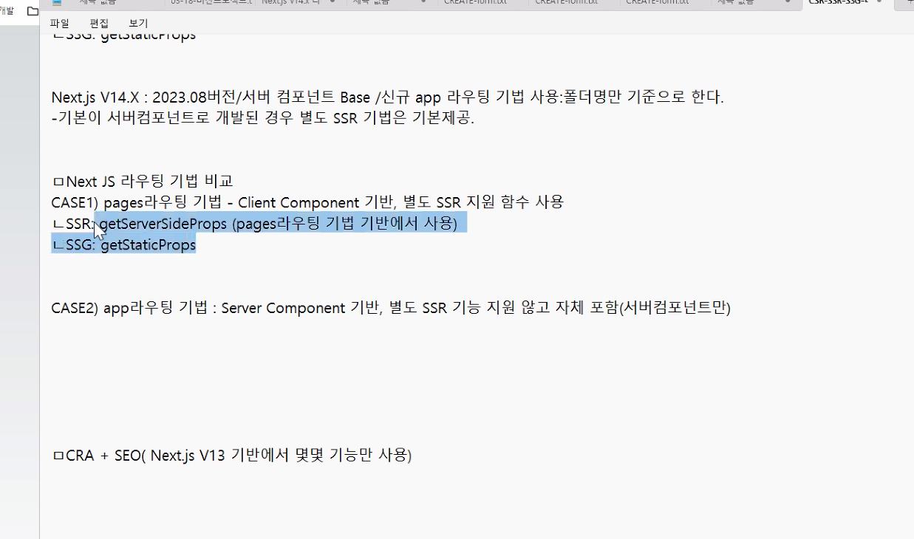

## 프론트엔드 UI 요소 만들어서 웹브라우저에 제공하는 방식 3~4가지

- STEP1) UI 결과물 생성
- STEP2) UI 결과물을 서비스하기 위해서는 서버환경을 통해 UI 결과물을 업로드하고 다운로드 할수있는 환경제공
- 서버에 있는 UI결과물을 최종 웹브라우저(클라이언트) 환경으로 가져와 실행시켜 사용자와 상호작용을 하게 한다.

---

CASE1) SPA방식 = CSR(ClientSideRendering) 방식 - CRA

- STEP1) 개발자 컴퓨터에서 UI결과물을 최종 빌드(번들링)한다. (모든화면/결과물을 정적 리소스로 생성)
- STEP2) 서버에 최종 UI결과물 업로드 서비스 환경
- STEP3) 서버에 보관된 결과물을 웹브라우저로 모두 가져와 실행
  - 최초에 서버에서 모든 UI요소 포함된 상태이고 필요한것은 데이터 뿐이고 데이터는 서버 백엔드 RESTFul 서비스를 통해 데이터를 클라이언트로 가져온다 (Cliend Fetching...)

CASE2) SSR 방식(Server Side Rendering)방식

- STEP1) 개발자가 UI 결과물을 최종빌드한다. (모든화면 - Client Component/Server Component)
- STEP2) 서버에 최종 UI결과물 업로드 서비스환경
- STEP3) 서버에 보관된 ClientComponent만 UI요소를 가져온다.
  (서버컴포넌트와 SSR로 개발된 서버컴포넌트느 ㄴ사용자가 요청시 서버상에서 최종 요소를 생성하고 웹브라우저로 렌더링시킨다.)
  - 부분 렌더링하여 초기 무거운 프론트엔드 소스 렌더링 비용 줄임
  - 필요한 시점에 서버에서 UI와 데이터를 섞은 결과물을 한방에 가져와서 처리한다.
  - SEO검색엔진 최적화를 서버에서 진행하고 결과물을 가져온다.

CASE3) Static Site Generation (SSG) 렌더링 방식

- STEP1) 개발자 컴퓨터에서 UI결과물을 최종 빌드(번들링)한다.
  - 빌드시점에서 특정 컴포넌트에서 필요로하는 데이터를 API를 통해 데이터를 가져와서 해당 데이터와 UI요소가 썩여있는 최종 정적 결과물을 빌드시점에서 UI+DATA결과물을 만들어 서버에 배포한다.
    - 빌드타임에 데이터가 잘 변경안되는 서비스의 경우 데이터+UI요소 최종결과물을 만들어 배포한다.

---

## React 프론트엔드 개발 기술의 흐름

- React(CRA) ===> React(Vite) ===> React(Next.js)
- React(Next.js)
  - Next.js V12~
  - Next.js V13.x : 기존 사용하던 패턴/클라이언트 컴포넌트 Base / pages 라우팅 기법사용
  - - Next.js V14.x : 2023.08버전/서버 컴포넌트 Base/신규 app 라우팅 기법 사용 :폴더명만 기준으로 한다.

ㅁ CRA +SEO (Next.js V13 기반에서 몇몇 기능만 사용)

